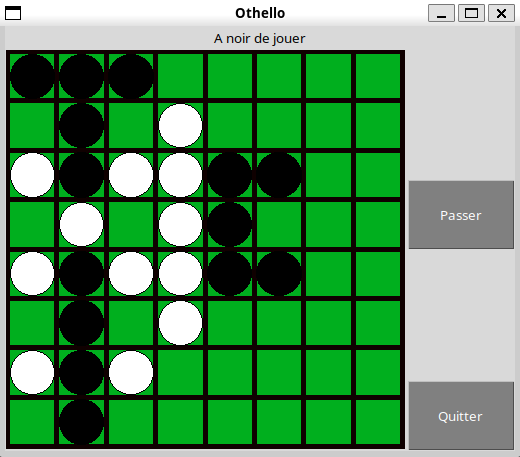

# TP02 - Othello



## Description

Pour une meilleur compréhension consulter **questions.ipynb**

Ce projet implémente un jeu de plateau stratégique avec plusieurs modes de joueurs basés sur l'intelligence artificielle. Le jeu permet d'affronter différents types de joueurs :

- **1 : Humain**  
- **2 : Random**  
- **3 : Minmax**  
- **4 : AlphaBeta**

Lors du lancement, le joueur est invité à choisir un mode pour le joueur noir puis pour le joueur blanc en tapant le nombre correspondant aux options listées.

## Comment lancer le projet

1. Assurez-vous d'avoir installé toutes les dépendances Python requises (numpy, matplotlib, etc.).
2. Lancez le jeu en exécutant la commande suivante :

   ```
   python3 jeulib.py
   ```

## Modes de jeu

- **Humain** : Le joueur effectue des choix manuels.
- **Random** : À chaque tour, un coup est choisi aléatoirement uniformément parmi les coups valides.
- **Minmax** : L'algorithme Minmax est utilisé pour explorer les coups avec une limite de profondeur.
- **AlphaBeta** : Variante optimisée de Minmax utilisant l'élagage alpha-beta.

Au démarrage, le programme affiche :

Quel type de joueur souhaitez vous sélectionner pour noir ? Les possibilités sont :
```
1  : <class 'joueurlib.Humain'>
2  : <class 'joueurlib.Random'>
3  : <class 'joueurlib.Minmax'>
4  : <class 'joueurlib.AlphaBeta'>
Tapez le nombre correspondant.
```